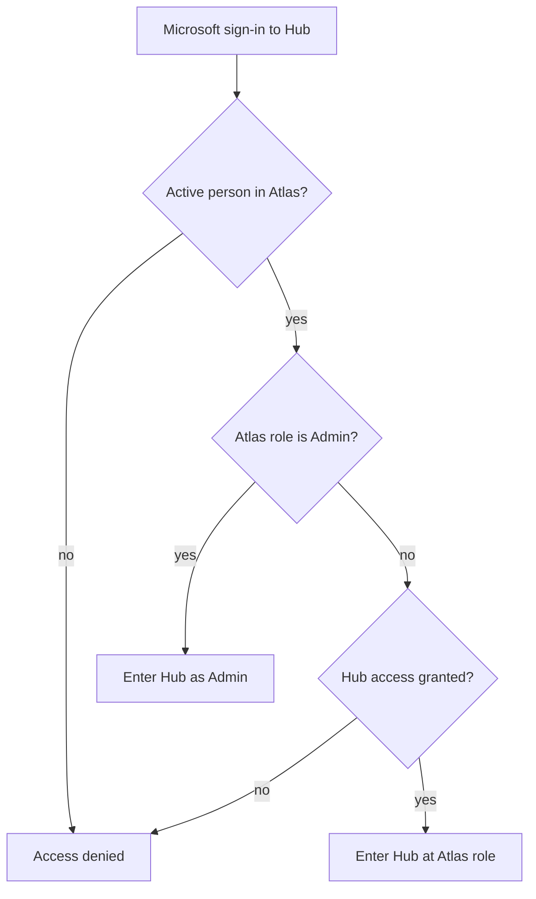
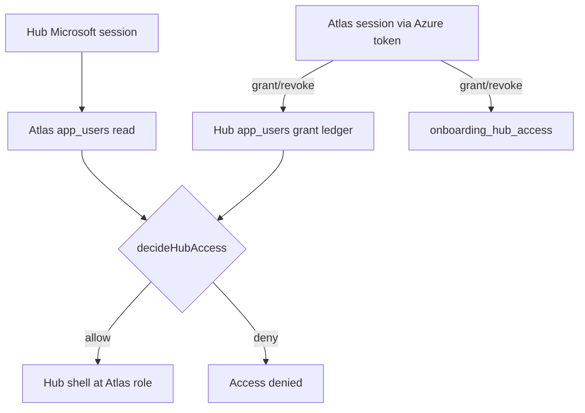

# Atlas-Controlled Hub User Management - Plan

## Goal Capsule

**Objective.** Make Atlas the source of truth for Onboarding Hub people, roles, and Hub access — tighter than Vulcan: Atlas Admins get Hub Admin automatically; everyone else must be granted from the Atlas roster; people already in Hub stay in.

**Product authority.** Decisions below are locked from the 2026-08-26 brainstorm with the product owner unless explicitly reopened.

**Open blockers.** None.

**Product Contract preservation.** Unchanged except Outstanding Questions, which planning resolved into KTD-1–KTD-4.

**Repos.** This plan lives in `onboarding.hub`. Atlas work is in sibling `atlasops` (`../atlasops` from this repo).

---

## Product Contract

### Summary

Onboarding Hub stops maintaining a separate typed-in user directory. Atlas owns identity, job role, and whether someone may use Hub. Atlas Admins can sign into Hub as Admin with no extra grant. All other people need an explicit Hub grant, chosen from the Atlas roster in Atlas Admin or Hub Admin. Existing Hub users remain authorized. Hub displays Atlas roles, with a one-time map for people already on Hub.

### Problem Frame

Hub already gates Microsoft sign-in against its own user list, and that list is edited by typing names and emails (or importing a spreadsheet). That is easy to over-provision for an app that should stay smaller than Atlas or Vulcan.

Vulcan already treats Atlas as the people directory: anyone in Atlas can sign in, Atlas Admins are Vulcan Admins, and Vulcan Admin is read-only with a link to Atlas. Hub needs that same Atlas-owned identity, but not Vulcan’s “everyone in Atlas is in” rule.

Hub and Atlas also use different role lists today, so the same person can look like Accounting or HR in Hub and Finance or General Office in Atlas.

### Key Decisions

- **Atlas owns people, roles, and Hub access.** Hub does not keep a parallel identity. Granting Hub access is a flag on the Atlas person, not a newly typed Hub user.
- **Tighter than Vulcan.** Vulcan allows every active Atlas user in. Hub does not. Only Atlas Admins auto-qualify; everyone else must be granted.
- **Both surfaces can grant.** Atlas Admin and Hub Admin can grant or revoke Hub access against the same Atlas roster. Hub Admin is a picker and revoke UI, not a free-typed editor.
- **Atlas Admins are uncuttable while they remain Admin.** They always have Hub Admin. After they are demoted in Atlas they keep Hub only if they were already a Hub user or were explicitly granted, then at their new Atlas role.
- **Existing Hub users stay authorized.** They are treated as already granted. Their live role is the Atlas role for that email, using the one-time map below only when a Hub-only role must be translated.
- **Terminated or deactivated Atlas people lose Hub access** even if they were granted or already on Hub, matching Vulcan.
- **Hub Admin cannot change Atlas job title.** Role edits stay in Atlas. Hub Admin cannot invent emails.

Role map for people already on Hub:

| Hub role today | Atlas role going forward |
| --- | --- |
| Admin | Admin |
| PM | Project Manager |
| Technician | Technician |
| Accounting | Finance |
| Logistics | Logistics |
| HR | General Office |
| Training | General Office |

### Actors

- A1. Atlas Admin — manages people and roles in Atlas; can grant or revoke Hub access; always has Hub Admin while they remain Admin.
- A2. Hub Admin — same people as Atlas Admins (plus any current Hub Admins only while they still qualify under the rules above). Grants or revokes Hub access by picking from the Atlas roster. Cannot type new emails or change Atlas job title.
- A3. Granted Hub user — active Atlas person who was already on Hub or was later granted. Signs into Hub at their Atlas role.
- A4. Atlas person without Hub grant — visible in the picker; cannot sign into Hub unless they are an Atlas Admin.
- A5. Deactivated Atlas person — Terminated or otherwise deactivated in Atlas; cannot sign into Hub.

### Key Flows

- F1. Atlas Admin signs into Hub
  - **Trigger:** An active Atlas Admin completes Microsoft sign-in on Hub.
  - **Actors:** A1
  - **Steps:** Hub checks Atlas. Role is Admin, so they enter as Hub Admin with no grant step.
  - **Outcome:** Access. Admin surfaces are available.
  - **Covered by:** R1, R2

- F2. Non-admin Atlas person is granted Hub access
  - **Trigger:** A1 or A2 picks an Atlas person who does not yet have Hub access and grants it.
  - **Actors:** A1, A2, A4 → A3
  - **Steps:** The person is chosen from the Atlas roster only. Hub access is stored on that Atlas person. They are not typed in by email.
  - **Outcome:** That person can sign into Hub at their current Atlas role.
  - **Covered by:** R3, R4, R8

- F3. Non-admin tries to sign in without a grant
  - **Trigger:** An active Atlas person who is not Admin and does not have Hub access signs in.
  - **Actors:** A4
  - **Steps:** Hub checks Atlas, sees neither Admin nor grant.
  - **Outcome:** Access denied. Message tells them an admin must add them from the Atlas list.
  - **Covered by:** R3, R10

- F4. Hub Admin revokes a non-admin
  - **Trigger:** A2 revokes Hub access for a granted non-admin.
  - **Actors:** A2, A3
  - **Steps:** Grant is removed. Atlas Admins cannot be revoked while they remain Admin.
  - **Outcome:** That person can no longer sign into Hub.
  - **Covered by:** R5, R6

- F5. Atlas Admin is demoted
  - **Trigger:** Someone’s Atlas role changes away from Admin.
  - **Actors:** A1 → A3 or A4
  - **Steps:** Auto Hub Admin ends. If they were already a Hub user or were explicitly granted, they keep Hub at the new Atlas role. Otherwise they lose Hub.
  - **Outcome:** No leftover Hub Admin for a demoted person unless grant or prior Hub membership remains.
  - **Covered by:** R6, R7

- F6. Atlas deactivates a person
  - **Trigger:** The person is Terminated or otherwise deactivated in Atlas.
  - **Actors:** A5
  - **Steps:** Hub treats them as unauthorized even if they were granted or already on Hub.
  - **Outcome:** Sign-in denied until they are active in Atlas again and still qualify (Admin or grant).
  - **Covered by:** R9

### Requirements

**Access gate**

- R1. Hub sign-in still uses Microsoft. Authorization after sign-in is decided from Atlas, not from a Hub-typed directory.
- R2. Every active Atlas Admin can sign into Hub as Admin immediately, with no grant step.
- R3. A person who is not an Atlas Admin can sign into Hub only if they are an active Atlas person and have Hub access granted (including people already on Hub at ship time).
- R4. Hub access for non-admins can be granted only by selecting an existing Atlas person. Free-typed name/email and spreadsheet import of new Hub users go away.
- R5. A1 and A2 can grant and revoke Hub access from Atlas Admin and from Hub Admin. Both surfaces change the same Atlas-owned grant.
- R6. While someone’s Atlas role is Admin, Hub access cannot be revoked. They remain Hub Admin.
- R7. After an Atlas demotion away from Admin, Hub continues only if that person was already on Hub or was explicitly granted. Auto-admin alone is not enough. Their Hub role becomes the new Atlas role.
- R8. Granted people’s Hub role is always their current Atlas role. Changing the role in Atlas changes Hub without a second edit in Hub.
- R9. Terminated or otherwise deactivated Atlas people cannot sign into Hub, including previously granted and already-on-Hub people.
- R10. Denied sign-in tells the person they are not on the approved Hub list and that an admin must add them from Atlas.

**Roles and grandfathering**

- R11. Hub uses the Atlas role list: Admin, Project Manager, Finance, General Office, Logistics, Bid Coordinator, Estimator, Project Engineer, Technician. Hub-only roles Admin-as-Hub-label, PM, Accounting, HR, Training are not kept as Hub roles.
- R12. Every person already on Hub at ship time remains authorized. Match by email to Atlas. Apply the role map in Key Decisions only as a translation of old Hub labels; live role after ship is the Atlas role for that email.
- R13. If an already-on-Hub email has no matching active Atlas person at ship time, they keep Hub access until an admin revokes them or they are added to Atlas. Planning may choose how that unmatched row is represented; product intent is they are not locked out by the cutover.

**Surfaces**

- R14. Atlas Admin shows Hub access next to the person (grant/revoke for non-admins; Atlas Admins shown as having Hub Admin automatically).
- R15. Hub Admin lists authorized Hub people (Atlas Admins plus granted people) with Atlas role and region, offers a picker of Atlas people who are not yet granted, and can revoke non-admins. It does not add invented emails or edit Atlas job title.
- R16. Hub Admin remains visible only to Hub Admins. View-as for real Hub Admins stays.

### Acceptance Examples

- AE1. Atlas Admin, never granted
  - **Covers:** R2, R6
  - **Given:** Alex is an active Atlas Admin and is not on the Hub grant list.
  - **When:** Alex signs into Hub with Microsoft.
  - **Then:** Alex enters as Hub Admin. A revoke action is not available against Alex while they remain Admin.

- AE2. Technician not granted
  - **Covers:** R3, R10
  - **Given:** Sam is an active Atlas Technician with no Hub grant and was not already on Hub.
  - **When:** Sam signs into Hub.
  - **Then:** Access is denied with the approved-list message.

- AE3. Grant from the Atlas list
  - **Covers:** R4, R5, R8
  - **Given:** A Hub Admin is signed in. Jordan is an active Atlas Logistics person without Hub access.
  - **When:** The admin picks Jordan from the Atlas list and grants Hub access, from either Atlas Admin or Hub Admin.
  - **Then:** Jordan can sign into Hub as Logistics. The other surface shows Jordan as granted without a second add.

- AE4. Already on Hub
  - **Covers:** R11, R12
  - **Given:** Riley is already on Hub as Accounting and exists in Atlas as Finance.
  - **When:** The new gate ships.
  - **Then:** Riley can still sign in. Hub treats Riley as Finance, not Accounting.

- AE5. Demote without grant
  - **Covers:** R7
  - **Given:** Casey is an Atlas Admin, was never already on Hub, and was never explicitly granted.
  - **When:** Casey’s Atlas role changes to Project Manager.
  - **Then:** Casey can no longer sign into Hub.

- AE6. Demote with prior Hub membership
  - **Covers:** R7, R8
  - **Given:** Morgan is an Atlas Admin and was already on Hub before this change.
  - **When:** Morgan’s Atlas role changes to General Office.
  - **Then:** Morgan can still sign into Hub as General Office, not Admin.

- AE7. Terminated in Atlas
  - **Covers:** R9
  - **Given:** Taylor was granted Hub access, then is Terminated in Atlas.
  - **When:** Taylor signs into Hub.
  - **Then:** Access is denied until Taylor is active in Atlas again and still Admin or granted.

- AE8. No free-typed add
  - **Covers:** R4, R15
  - **Given:** A Hub Admin is on User Management.
  - **When:** They try to add a person who is not on the Atlas roster by typing an email.
  - **Then:** There is no path to create that Hub user. They can only pick from Atlas.

### Success Criteria

- An Atlas Admin can open Hub after Microsoft sign-in without anyone adding them.
- A non-admin Atlas person cannot get in until an admin picks them from Atlas.
- People already on Hub still get in after cutover.
- The same grant is visible and editable from Atlas Admin and Hub Admin.
- Hub User Management no longer accepts invented emails or spreadsheet-created users.
- Hub shows Atlas role names, not the old Hub-only set.

### Scope Boundaries

**In**

- Authorization model, role display, and User Management on Hub.
- Hub-access grant/revoke on Atlas Admin for the same people.
- Cutover so current Hub users remain authorized.

**Not in this work**

- Opening Hub to every Atlas user (Vulcan’s model).
- New Hub features outside user management and the sign-in gate.
- Editing Atlas job title, region, or employment status from Hub.
- Replacing Microsoft sign-in.
- Changing New Hire Checklist, tasks, orientation, or other Hub content.

**Deferred for later**

- Hub-specific permission flags beyond Atlas role (for example a Training-only capability that Atlas does not have).
- Automatic Hub access for additional Atlas roles (Finance, HR-equivalent, and so on).

### Dependencies / Assumptions

- Atlas remains the company people directory, as Vulcan already assumes.
- Hub and Atlas stay separate apps with separate sign-in sessions; only the people/role/grant source moves to Atlas.
- “Already on Hub” is the Hub authorized-user list at cutover, matched by email.
- Atlas employment deactivation (Terminated / removed from the active roster) is the same signal Vulcan uses to block sign-in.
- Current Hub Admins who are also Atlas Admins keep Hub Admin via R2. A current Hub Admin who is not an Atlas Admin keeps access via R12 at their Atlas role, and therefore loses Hub Admin unless they are made an Atlas Admin.

### Outstanding Questions

None remaining as planning blockers. Storage, orphan rows, Atlas chrome, and Hub archive behavior are decided in the Planning Contract (KTD-1–KTD-4).

### Sources / Research

- Vulcan treats Atlas as read-only source of truth for people and permissions: anyone in Atlas can sign in; Atlas Admins are Vulcan Admins; Vulcan Admin is view-only with a Manage in Atlas link (`Projects/Tool tracker` auth and admin copy).
- Hub today gates Microsoft sign-in against its own authorized-user list and lets Hub Admins add users by typed email or spreadsheet (`hub-auth.js`, `hub-admin.js`).
- Atlas roles today: Admin, Project Manager, Finance, General Office, Logistics, Bid Coordinator, Estimator, Project Engineer, Technician.
- Hub roles today: Admin, PM, Technician, Accounting, HR, Logistics, Training.

---

## Planning Contract

### Key Technical Decisions

- KTD-1. **Grant lives on Atlas `app_users.onboarding_hub_access` (boolean, default false).** Atlas Admin updates it with existing admin-only RLS. Hub reads Atlas `app_users` the way Vulcan does (separate Atlas client + publishable key). Do not open Atlas `app_users` writes to anon.
- KTD-2. **Hub Admin always writes the Hub grant ledger with the Hub session (existing admin RLS).** When possible, also attach an Atlas session from the Hub Azure token (`signInWithIdToken` or equivalent) and update `onboarding_hub_access` so Atlas Admin shows the same grant. Never add a public Atlas RPC or anon write policy. If Atlas token exchange fails, ledger-only grants still work at login (KTD-3 OR); Hub Admin should prompt the operator to confirm the Atlas control when they next open Atlas, and first successful Atlas session backfills flags from the ledger.
- KTD-3. **Grandfather and orphans use Hub `app_users` as a grant ledger, not as identity.** Login allow: active Atlas person AND (Atlas Admin OR `onboarding_hub_access` OR Hub `app_users` row for that email). Live name/role/region always come from Atlas when the Atlas row exists. Existing Hub rows keep people in at cutover (R12). Hub-only emails with no Atlas row stay in via the ledger until revoked (R13). New grants set the Atlas flag (and may insert a ledger row so Hub Admin revoke still works if Atlas write later fails). Revoke clears the Atlas flag and removes/soft-deletes the ledger row. Atlas Admins are never stored as a required grant.
- KTD-4. **Atlas Admin chrome is a per-row Onboarding Hub control**, not a separate tab. Admins show as automatic Hub Admin (control on and disabled). Terminated/deleted people cannot be granted. Hub Admin drops typed add, role/region editors, and spreadsheet import; it becomes authorized-people list + Atlas picker + revoke. No Hub-side employment archive — Atlas employment/deleted is the archive. A small “Hub-only leftover” list is allowed for R13 orphans.
- KTD-5. **Extract `decideHubAccess(atlasUser, hubLedgerRow)` as a pure function** in Hub so login policy is unit-tested with Node’s test runner. Checklist task roles (HR/PM in `hub-checklist.js`) stay; only `mapAppUserToChecklistRole` gains Atlas role keys.

**Product Contract preservation.** Requirements R1–R16 and AE1–AE8 unchanged. Outstanding Questions closed as KTD-1–KTD-4.

### High-Level Technical Design

Login treats `deleted_at` set OR `employment_status = terminated` as inactive (same as Atlas auth). Leave stays allowed.

### Assumptions

- Atlas `app_users` remains anonymously readable (Vulcan already depends on this).
- Hub Azure OAuth can yield a token Atlas will accept for `signInWithIdToken`. If preview/local cannot prove that, Hub Admin grant degrades to “use Atlas Admin” rather than a public write policy.
- Sibling repo `atlasops` is writable in the same implementation pass.
- Hub has no existing app test suite; new coverage is `node --test` on the access helper.

### Sequencing

U1 (decision helper + tests) → U2 (Atlas column) → U3 (Atlas Admin UI) and U4 (Hub login) in parallel after U2 → U5 (Hub Admin UI, needs U4 Atlas client) → U6 (checklist map + README).

---

## Implementation Units

### U1. Hub access decision helper and tests

**Goal:** Encode the allow/deny rules in one pure function so login and admin UI cannot drift.
**Requirements:** R2, R3, R6, R7, R9, R12, R13
**Dependencies:** None
**Files:** `js/hub-access.js` (create), `scripts/hub-access.test.js` (create), `package.json` (add `test` script)
**Approach:** Export `decideHubAccess({ atlasUser, hubLedgerRow })` returning `{ ok, reason, role, source }`. Reasons at least: `missing_email`, `not_in_atlas`, `inactive`, `not_allowlisted`, `ok_admin`, `ok_grant`, `ok_ledger`. Atlas Admin ⇒ Hub Admin regardless of flag. Inactive = no row, `deleted_at`, or terminated. Ledger-only (no Atlas row) ⇒ allow with mapped/legacy role only for grandfather orphans. Do not put Supabase clients in this file.
**Execution note:** Implement the helper test-first with `node --test`.
**Patterns to follow:** Keep the module IIFE-free CommonJS or ESM that both Node tests and a small browser wrapper can load; if the rest of Hub is browser globals, expose `window.HubAccess` from the same file via a tiny `typeof window` guard.
**Test scenarios:**
- Covers AE1. Active Atlas Admin, no flag, no ledger ⇒ allow, role admin, source admin.
- Covers AE2. Active technician, no flag, no ledger ⇒ deny `not_allowlisted`.
- Covers AE4. Active Atlas finance + ledger row ⇒ allow, role `finance` (Atlas wins over old Hub accounting).
- Covers AE5. Demoted PM, no flag, no ledger ⇒ deny.
- Covers AE6. Demoted general_office + ledger ⇒ allow, role general_office.
- Covers AE7. Terminated with flag true ⇒ deny `inactive`.
- Ledger orphan, no Atlas row ⇒ allow with ledger role (R13).
- `deleted_at` set ⇒ deny `inactive`.
**Verification:** `npm test` (or `node --test scripts/hub-access.test.js`) is green.

### U2. Atlas `onboarding_hub_access` column

**Goal:** Persist Hub grants on Atlas people without weakening admin-only writes.
**Requirements:** R5, R12
**Dependencies:** None (can start after U1)
**Files:** `../atlasops/supabase/migrations/20260827090000_onboarding_hub_access.sql` (create)
**Approach:** `alter table public.app_users add column if not exists onboarding_hub_access boolean not null default false`. No public write policy changes. Comment that cutover backfill of existing Hub emails is done by Hub Admin first load (U5) and/or a follow-up SQL snippet listing Hub emails — do not invent emails in the migration. After the file is written, copy it to the macOS clipboard per AtlasOps migration convention.
**Patterns to follow:** `../atlasops/supabase/migrations/20260826100000_app_users_employment_profile.sql` (additive column + default).
**Test scenarios:**
- New Atlas users have `onboarding_hub_access = false`.
- Existing Atlas rows remain readable; column is boolean not null.
**Verification:** Migration SQL is valid Postgres and only adds the column + optional index on `onboarding_hub_access where deleted_at is null and onboarding_hub_access = true`. Clipboard copy completed.

### U3. Atlas Admin Onboarding Hub control

**Goal:** Atlas Admins grant/revoke Hub access on the person row.
**Requirements:** R5, R6, R14
**Dependencies:** U2
**Files:** `../atlasops/admin.html` (modify)
**Approach:** On each non-archive user row, add an Onboarding Hub checkbox (or equivalent control). Atlas `role === 'admin'` ⇒ checked and disabled, label that Hub Admin is automatic. Saving a non-admin writes `onboarding_hub_access` only (do not require a full row edit). Unchecking an Admin is impossible. Terminated archive rows: no grant control. Include a one-line note that Hub also lists these people and that Atlas Admins always have Hub Admin.
**Patterns to follow:** Existing employment status control and `renderUserRow` in `admin.html`.
**Test scenarios:**
- Covers AE1. Admin row shows Hub access on and not revocable.
- Covers AE3 (Atlas side). Checking the box for a logistics user persists `onboarding_hub_access = true`.
- Unchecking a granted technician persists false.
**Verification:** In Atlas Admin, toggle a non-admin and confirm the column updates; Admin rows cannot be turned off.

### U4. Hub login against Atlas

**Goal:** Microsoft still signs into Hub Supabase; authorization uses Atlas + ledger.
**Requirements:** R1, R2, R3, R8, R9, R10, R11, R12, R13
**Dependencies:** U1, U2
**Files:** `config.js` (add Atlas URL + publishable key), `hub-auth.js` (modify), `js/hub-access.js` (consume)
**Approach:** Mirror Vulcan: Atlas client for `app_users` select (`id, email, full_name, role, region, deleted_at, employment_status, onboarding_hub_access`). After Hub session, load Atlas row by email and Hub ledger row by email; call `decideHubAccess`. On allow, set `hubRealUser` from Atlas fields (role = Atlas role) and keep ledger `id` only if view-as still keys off Hub ids — prefer Atlas id as `id` and keep `ledgerId` if needed. Attach Atlas session via Azure token when present (needed by U5). Deny copy per R10. Do not allow login solely because Hub `app_users.role` was admin if Atlas says otherwise (except R13 orphan with no Atlas row).
**Patterns to follow:** `../Tool tracker/js/tt-auth.js` Atlas client + `fetchAppUserByEmail`; existing Hub `loadAppUser` / `denyAccess`.
**Test scenarios:**
- Covers AE1, AE2, AE4, AE7 at runtime against decideHubAccess (unit tests already in U1).
- Integration: Atlas Admin with no Hub ledger row still enters Hub.
- Denied user sees the approved-list message, not a generic auth error.
**Verification:** Local Hub sign-in as Atlas Admin succeeds; a non-granted technician is denied.

### U5. Hub Admin picker and revoke

**Goal:** Replace typed User Management with Atlas-roster grant/revoke.
**Requirements:** R4, R5, R6, R15, R16
**Dependencies:** U4
**Files:** `hub-admin.js` (modify), `index.html` (User Management markup if it embeds import UI)
**Approach:** Load Atlas people (active, not terminated). Authorized list = Atlas Admins ∪ `onboarding_hub_access` ∪ Hub ledger emails, displaying Atlas role/region. Picker = active Atlas people not yet authorized (exclude those already in the authorized set). Grant: set Atlas `onboarding_hub_access` true (requires Atlas admin session from U4) and upsert ledger email. Revoke: set flag false, remove ledger row; block if Atlas role is admin. Remove free-typed add, role/region selects, and spreadsheet import. On first successful Atlas write session, backfill `onboarding_hub_access = true` for every current ledger email that exists in Atlas (R12 cutover). Leftover ledger emails with no Atlas person render in a Hub-only leftover section with revoke only.
**Patterns to follow:** Vulcan admin “from Atlas” framing; keep Hub visual style. Atlas `listAtlasUsers` shape from Vulcan.
**Test scenarios:**
- Covers AE3. Pick Jordan (logistics) ⇒ appears authorized; Atlas checkbox also on after refresh.
- Covers AE8. No email text field that inserts a non-Atlas user.
- Covers AE1. Authorized Atlas Admin has no revoke.
- Backfill: existing Hub ledger emails get Atlas flags once an Atlas Admin uses Hub Admin.
**Verification:** Hub Admin can grant a picker user and revoke them; cannot type a new email; Atlas Admin sees the same grant.

### U6. Checklist role map and operator docs

**Goal:** Atlas app roles map into existing checklist filters; operators know the cutover.
**Requirements:** R11
**Dependencies:** U4
**Files:** `hub-checklist.js` (modify `mapAppUserToChecklistRole`), `README.md` (modify), `supabase-schema.sql` (comment that `app_users` is a grant ledger)
**Approach:** Extend the map: `project_manager` → PM, `finance` → HR (old accounting mapping), `general_office` → HR, `bid_coordinator` / `estimator` / `project_engineer` → all or PM as the closest existing checklist role — use PM for project_manager/project_engineer/bid_coordinator/estimator, HR for finance/general_office, Logistics for logistics, Technician → all, Admin → Admin. Do not add new checklist role IDs in this work. README: Atlas-managed access, both Admin UIs, grandfather note, apply Atlas migration.
**Test scenarios:**
- A Hub session with Atlas role `project_manager` maps checklist filter to PM.
- A Hub session with Atlas role `finance` maps to HR (same as old accounting).
**Verification:** README matches shipped behavior; checklist still opens for a granted PM.

---

## Verification Contract

| Gate | Command / check | Applies to |
| --- | --- | --- |
| Unit tests | `npm test` | U1, U4 |
| Atlas migration | SQL applied in Atlas Supabase SQL editor | U2, U3 |
| Hub smoke | `npm run dev` → Microsoft sign-in | U4, U5, U6 |
| Atlas smoke | Atlas Admin → Onboarding Hub control | U3, U5 |

No existing Hub browser test suite. Do not add Playwright in this pass.

---

## Definition of Done

- `decideHubAccess` tests cover AE1–AE2, AE4–AE7 and R13 orphan.
- Atlas column exists; Atlas Admin can grant/revoke non-admins; Admins are automatic and not revocable.
- Hub login uses Atlas identity/role; Atlas Admins get in without a grant; non-admins need flag or ledger; terminated/deleted are out.
- Hub Admin is picker + revoke only; import/typed add gone; cutover backfill runs for existing ledger emails.
- Checklist still functions with the extended role map.
- README describes Atlas-managed Hub access.
- Both repos have the code changes; Atlas migration contents were copied to the clipboard when created.

**Per-unit done** is the Verification field on each unit plus the gates above.
